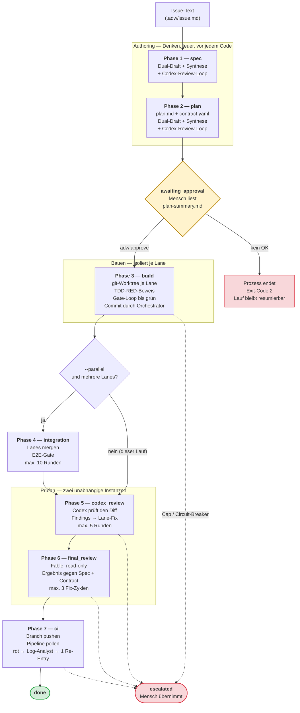
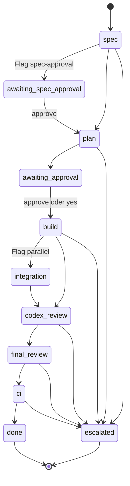
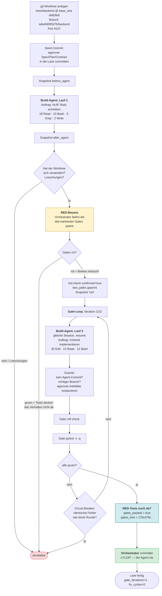
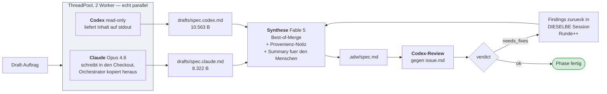
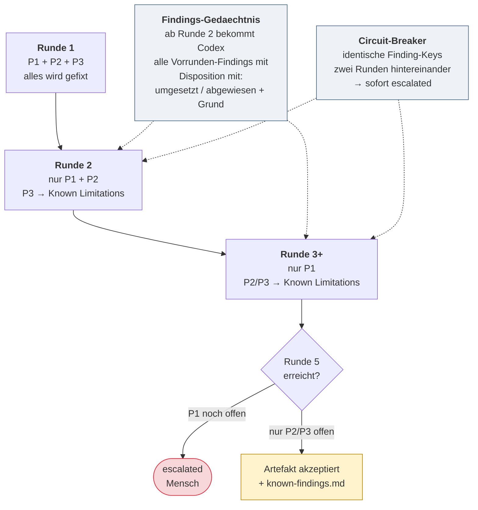
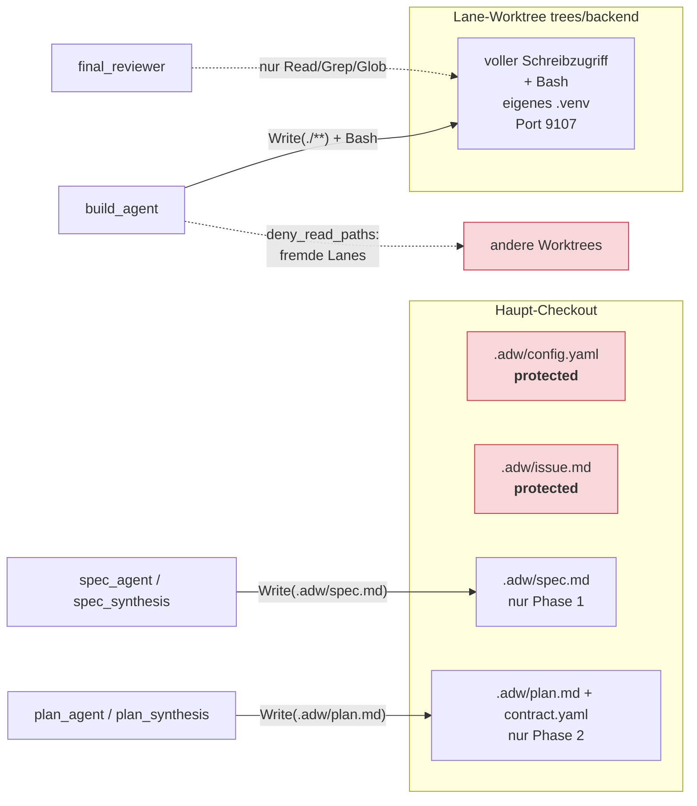

# ADW-Flow — Handout am Beispiel von Lauf `b65f5d75`

> Analysiertes Artefaktverzeichnis: `.adw/runs/b65f5d75/`
> ADW-Version 0.11.0 · Ziel-Repo: `agentic-developer-workflow` (ADW auf sich selbst)
> Lauf-Fenster: 2026-08-26, 11:06:33Z – 12:30:50Z

---

## TL;DR

ADW ist ein **Orchestrator**, kein Agent. Er zerlegt „Issue → gemergter, CI-grüner
Code" in **7 Phasen**, besetzt jede Phase mit einem eng zugeschnittenen Agenten und
umgibt jede Phase mit **maschinell geprüften Beweisen** (RED-Beweis, Gate-Beweis,
Tree-Hash-Bindung) statt mit Vertrauen in Agenten-Selbstauskunft.

Lauf `b65f5d75` setzte das Issue „Vom Knoten in den Raw-Log springen + Prompt-Diff
gegen die Vorrunde" um:

| Kennzahl | Wert |
|---|---|
| Wall-Clock gesamt | 84,3 min (davon ~36 min menschliche Pause am Approval-Gate) |
| Reine Maschinenzeit | 48,3 min (2 Prozess-Segmente: 17,4 min + 30,9 min) |
| Kosten (Claude-Agenten) | **25,60 $** — Codex-Aufrufe extern, nicht enthalten |
| Token | 17,70 Mio. |
| Events im Trace | 580 (45 Span-Paare + 490 Punkt-Events) |
| Agenten-Läufe | 11 (5 verschiedene Agent-Rollen) |
| Codex-Aufrufe | 2 × Autor, 7 × Reviewer |
| Ergebnis | `done` — 9 Dateien, +859/−23 Zeilen, 17 neue Tests, CI grün |
| Eskalationen | keine · Fix-Zyklen: 0 · Gate-Iterationen: 1 |

Bemerkenswert: **die Kosten liegen fast vollständig vor dem Code.** Spec + Plan
kosteren 9,63 $, der eigentliche Build 13,44 $ — und der Build brauchte danach
**null** Korrekturrunden. Das ist die These des Systems in Zahlen: Nachdenken vorne
ist billiger als Nachbessern hinten.

---

## 1. Was ADW ist — die Grundidee

Drei Konstruktionsprinzipien erklären fast jede Design-Entscheidung im Code:

1. **Zwei Autoren, ein Synthetiker.** Jedes Denk-Artefakt (Spec, Plan, Contract)
   wird von **zwei unabhängigen Modellen parallel** entworfen (Claude Opus im
   Repo-Checkout, Codex read-only) und danach von einem dritten Agenten zu einer
   Best-of-Fassung verschmolzen. Kein Einzelmodell bestimmt allein die Richtung.
2. **Der Orchestrator glaubt keinem Agenten.** Agenten dürfen nicht committen. Ob
   Tests rot waren, ob Gates grün waren, ob sich überhaupt etwas geändert hat,
   stellt der Orchestrator selbst fest und persistiert es als Beweis — an den
   **exakten Tree-Hash** des Worktrees gebunden, damit ein Crash-Fenster keinen
   Beweis auf einen anderen Baum umhängen kann.
3. **Jeder Loop hat einen Deckel und ein Gedächtnis.** Runden-Caps, ein
   Circuit-Breaker gegen identische Findings und eine über die Runden **absteigende
   Severity-Schwelle** verhindern das Oszillieren, an dem naive Review-Schleifen
   sterben.

---

## 2. Der Gesamt-Flow



Die Phase steht in `state.json` (`phase`). Jede Phasenfunktion prüft **selbst**, ob
sie dran ist (`if ctx.state.phase != "build": return`) — deshalb ist ein Resume
nach Crash oder Approval-Pause einfach „alle Phasenfunktionen nochmal der Reihe
nach aufrufen".

### Phasen-Zustandsmaschine



---

## 3. Der Lauf in der Zeitachse

```mermaid
gantt
    title Lauf b65f5d75 — 84 min Wall-Clock davon 36 min menschliche Pause
    dateFormat  HH:mm
    axisFormat  %H:%M

    section Segment 1 · 9,63 $
    Spec Dual-Draft Opus plus Codex     :a1, 11:06, 2m
    Spec-Synthese plus 3 Review-Runden  :a2, 11:08, 5m
    Plan Dual-Draft Opus plus Codex     :a3, 11:13, 4m
    Plan-Synthese plus 3 Review-Runden  :a4, 11:17, 7m

    section Approval-Gate
    Mensch liest plan-summary.md        :crit, b1, 11:24, 36m

    section Segment 2 · 15,98 $
    Worktree plus Seed-Commit           :c0, 12:00, 1m
    Build-Agent Test-Lauf TDD RED       :c1, 12:01, 11m
    RED-Beweis durch den Orchestrator   :milestone, mz, 12:12, 0m
    Build-Agent Implementierung         :c2, 12:12, 12m
    Gates ruff und pytest gruen         :c3, 12:24, 1m
    Codex-Code-Review 1 Runde ok        :c4, 12:25, 1m
    Final Review Fable 1 Runde ok       :c5, 12:26, 3m
    Push und GitHub-CI 5 Polls          :c6, 12:29, 2m
```



---

## 4. Phase für Phase — was in `b65f5d75` wirklich passierte

### Phase 1 — `spec` (0,0 – 6,7 min)

| Schritt | Akteur | Modell | Dauer | Kosten |
|---|---|---|---|---|
| Draft A | `spec_agent` | Opus 4.8 | 1,5 min | 0,46 $ |
| Draft B | Codex (`codex exec --sandbox read-only`) | — | parallel | extern |
| Synthese R1 | `spec_synthesis` | Fable 5 | 2,5 min | 1,83 $ |
| Fix R2 | `spec_synthesis` | Fable 5 | 0,5 min | 1,14 $ |
| Fix R3 | `spec_synthesis` | Fable 5 | 0,7 min | 0,40 $ |

Drei Codex-Review-Runden, zwei davon mit Findings — **beide inhaltlich substanziell,
nicht kosmetisch**:

1. **P2:** „Akzeptanzkriterium 5 behauptet, das Intervall `[seq, end_seq]` zeige
   *genau* die Events dieses Teilbaums. Ein Sequenz-Intervall kann
   Teilbaum-Zugehörigkeit nicht garantieren, wenn Events verschränkter Spans
   hineinfallen." → Die Spec wurde von „genau die Events des Teilbaums" auf
   „reiner Intervall-Vorfilter" korrigiert. Ohne diesen Fund wäre ein
   nicht-erfüllbares Kriterium in die Implementierung gegangen.
2. **P2:** „AK 8–9 erlauben, einen Vorgänger mit kaputtem Prompt zu überspringen
   und gegen N−2 zu diffen — das widerspricht E3." → Vorgängerauswahl wurde strikt
   zweistufig getrennt: **erst strukturell** (größte kleinere `seq`), **dann**
   Verwertbarkeit.
3. Runde 3: `{"verdict":"ok","findings":[]}` → Phase beendet.

### Phase 2 — `plan` (6,7 – 17,4 min)

Gleiches Muster, zwei Artefakte statt einem: `plan.md` (Workstream-Schritte B1–B7)
**und** `contract.yaml` (OpenAPI 3.1 + `x-behavior`-Regeln R1–R7, D1–D3).

Der Contract ist das eigentliche Steuerinstrument: Er pinnt **nur die extern
beobachtbare Fläche** — Query-Parameter, Antwortfelder, Verhalten bei ungültigen
Werten — und ausdrücklich *keine* internen Helper-Signaturen, kein Markup, kein CSS.

Drei Runden, und hier zeigt die Review-Policy ihren Zweck:

| Runde | Findings | Ausgang |
|---|---|---|
| 1 | P2 (Schema referenziert die neuen Felder gar nicht) + P3 (Contract nennt interne Helper) | beide gefixt |
| 2 | P2 (`additionalProperties: true` erlaubt die Felder auch an Fremdknoten) | gefixt via `if/then/else`-Conditional |
| 3 | P3 (Contract schreibt noch eine interne Datenquelle vor) | **unter der Schwelle** → akzeptiert |

Ab Runde 3 sind nur noch P1 blockierend. Das übrig gebliebene P3 wurde nicht
stillschweigend geschluckt, sondern nach
`authoring-plan-known-findings.md` geschrieben und als `log`-Warning ins Event-Log
emittiert. **Loop-Terminierung mit Papierspur statt Erschöpfung.**

### Approval-Gate (17,4 – 53,4 min)

Der Prozess **endet** hier mit Exit-Code 2 (`awaiting_approval`) — kein Warten,
kein laufender Prozess. Vor der Pause räumt ADW den Haupt-Checkout auf: Spec, Plan,
Contract, Issue und die Summaries wandern ins Run-Verzeichnis, damit die 36 Minuten
Pause keinen dirty Checkout hinterlassen.

Entscheidungsgrundlage für den Menschen ist bewusst **nicht** der 15 kB große Plan,
sondern `plan-summary.md`: Was & warum, Kernentscheidungen, Scope-Grenzen,
**Provenienz** (welcher Draft welchen Teil beigesteuert hat und wo die beiden
Autoren uneins waren), Review-Runden, offene Fragen.

> Aus diesem Lauf: „Einziger echter Dissens: nicht-numerische Bereichswerte —
> Codex wollte eine leere Treffermenge, Claude ‚Grenze inaktiv'; entschieden für
> Claude, weil E4 ‚wie die bestehenden Raw-Filter' verlangt."

Danach: `adw approve b65f5d75` → neues Prozess-Segment, `run.start` Nr. 2 im selben
Event-Log, `approval granted`.

### Phase 3 — `build` (53,4 – 78,4 min) — das Herzstück



**Der TDD-RED-Beweis ist der interessanteste Mechanismus des ganzen Systems.**
Der Agent bekommt zuerst einen Auftrag, der *nur* Tests erlaubt. Danach fährt der
**Orchestrator selbst** die als `tdd: true` markierten Gates. Sind sie grün, ist das
eine **Eskalation, kein Erfolg**: dann testen die Tests nicht das geforderte
Verhalten (oder es existiert bereits). Die Pfade der rot gewordenen Tests werden im
State gepinnt — am Ende wird geprüft, dass sie noch existieren. Grüne Gates durch
Löschen der Tests sind damit ausgeschlossen.

In diesem Lauf: 2 Test-Dateien, 17 Testfunktionen, `pytest` Exit 1 → `red.check
confirmed=true`. Dann **eine einzige** Gate-Iteration: Implementierung in 11,7 min,
`ruff` grün, `pytest` grün. Kein Fix-Zyklus.

Ergebnis-Commit `c7c13f7`:

```
 CHANGELOG.de.md                   |  24 ++++
 CHANGELOG.md                      |  21 +++
 adw/gui/app.py                    | 144 ++++++++++++++++++--
 adw/gui/i18n.py                   |  12 ++
 adw/gui/templates/run_detail.html |  50 +++++--
 docs/GUI-SPEC.de.md               |  41 +++++-
 docs/GUI-SPEC.md                  |  36 ++++-
 tests/test_gui_prompt_diff.py     | 276 +++++++++++++++++++++++++++++++++++++
 tests/test_gui_raw_range.py       | 278 ++++++++++++++++++++++++++++++++++++++
```

### Phase 4 — `integration`: übersprungen

Das Repo ist per `.adw/config.yaml` bewusst Single-Lane (die GUI-Templates sind Teil
des Python-Pakets; eine eigene Frontend-Lane brächte nur Merge-Risiko). Ohne
`--parallel` geht `build` direkt nach `codex_review`.

### Phase 5 — `codex_review` (78,4 – 79,5 min)

Codex bekommt die geänderten Dateien im Lane-Worktree und reviewt den Diff gegen
Spec und Contract. Ergebnis: **`{"verdict":"ok","findings":[]}`** in Runde 1.

Hätte es Findings gegeben, wären sie über das `lane`-Feld des Findings in die
Build-Lane zurückgeroutet worden — als Fix-Task an dieselbe Agenten-Session, danach
erneut durch den Gate-Loop.

### Phase 6 — `final_review` (79,5 – 82,2 min)

`final_reviewer` (Fable 5, **read-only**: nur `Read`/`Grep`/`Glob`) prüft das
Ergebnis gegen `.adw/spec.md` und `.adw/contract.yaml` — 12 Reads, 14 Greps, 2,53 $.
Verdict `ok`.

Zwei unabhängige Prüfer mit unterschiedlichem Blick: Codex sieht den **Diff**,
Fable sieht das **Ergebnis gegen die Akzeptanzkriterien**. Ein `scope_gap`-Finding
des Final Reviewers landet nicht im Fix-Zyklus, sondern im Follow-up-Report — die
Spec ist die Autorität, nicht die Meinung des Reviewers.

### Phase 7 — `ci` (82,2 – 84,3 min)

Branch pushen → GitHub-Pipeline pollen, **gebunden an die gepushte SHA**, damit
nicht die terminale Pipeline eines früheren Push das frische Ergebnis bewertet.

```
ci.poll  keine Runs
ci.poll  in_progress
ci.poll  in_progress
ci.poll  in_progress
ci.poll  completed
ci.wait  end  status=success  polls=5  duration=120s
```

Bei rot: Log-Analyst (Sonnet) liest den Log-Auszug, erzeugt Findings, **genau ein**
Re-Entry in die Lane-Loops. Danach übernimmt der Mensch. Rot **ohne** verwertbare
Job-Logs eskaliert sofort — „ein Analyst ohne Evidenz würde nur halluzinieren und
das Re-Entry verbrennen".

---

## 5. Die drei wiederkehrenden Muster

### 5.1 Dual-Author + Synthese (Phasen 1 und 2)



Ein fehlgeschlagener Codex-Draft **degradiert** (Marker-Datei, Synthese läuft mit
einem Draft weiter) statt zu eskalieren. Ein fehlender Claude-Draft eskaliert.

**Schutz gegen den untätigen Agenten:** Vor dem Draft wird der Checkout-Stand
gesnapshottet. Hat sich das Artefakt nach dem Lauf **nicht verändert**, eskaliert
ADW — sonst könnte Altbestand eines früheren Runs als frisches Artefakt durchgehen.

### 5.2 Review-Loop-Policy — absteigende Severity + Findings-Gedächtnis



Ohne diese Policy konvergiert der Loop bei Orchestrierungs- und Crash-Fenster-Code
prinzipiell nicht — ein Reviewer findet dort unbegrenzt Randfälle. Die Kombination
aus **absteigender Schwelle** (Bagatellen blocken irgendwann nicht mehr),
**Gedächtnis** (Codex meldet Abgewiesenes nicht erneut) und **hartem Cap**
terminiert garantiert. Die Caps: Authoring 5, Codex-Code-Review 5, Final-Review-Fix
3, Gate-Iterationen 10, E2E-Integration 10, CI-Re-Entry 1.

In diesem Lauf griff die Schwelle genau einmal: Plan-Runde 3, ein P3 → akzeptiert.

### 5.3 Beweise statt Vertrauen

| Beweis | Wogegen er schützt | Wie er gebunden ist |
|---|---|---|
| `red_confirmed` + `red_test_paths` | Tests, die nie rot waren; Tests, die am Ende gelöscht sind | Orchestrator fährt die Gates selbst; Pfade werden am Ende erneut geprüft |
| `gates_passed` + `gates_tree` | Commit-Message-Fälschung; Manipulation im Crash-Fenster | SHA1 des **exakten** Worktree-Baums inkl. untracked Files |
| `expected_head` | Agent, der heimlich committet | HEAD wird **vor** jedem Agenten-Lauf persistiert und danach verglichen |
| `protected`-Snapshots | Agent, der `.adw/config.yaml` oder `issue.md` umschreibt | Restore nach **jedem** Agenten-Lauf, vor dem Review, und im `finally` |
| `_restore_approved_artifacts` | Agent, der die approvte Spec während des Builds anpasst | Restore vor Gates **und** vor Commit — beide sehen denselben Stand |
| Prior-Content-Check | untätiger Agent, dessen Altbestand als Ergebnis durchgeht | Byte-Vergleich Artefakt vorher/nachher |
| Snapshots `before_agent`/`after_agent`/`red`/`after_gates` | Nicht-Nachvollziehbarkeit | 6 git-Refs unter `refs/adw/b65f5d75/*` |

Und die wichtigste Regel, in einer Zeile Code: **`You do not commit.`** steht in
jedem Build-Task. Committen darf nur der Orchestrator, und nur nach grünen Gates.

---

## 6. Isolation: was ein Agent überhaupt anfassen darf



Jede Agent-Rolle hat eine eigene `allowed_tools`-Whitelist mit **pfadgenauen**
Regeln. Der Build-Agent darf im Worktree alles und sieht die Worktrees anderer Lanes
nicht. Der Final Reviewer hat kein Schreibwerkzeug — er *kann* nicht reparieren,
was er reviewt.

---

## 7. Das Telemetrie-Modell

Alles Beobachtbare landet als **eine Zeile JSON** in `events.jsonl`:

```json
{"seq": 1, "ts": "…Z", "type": "run", "kind": "start",
 "span": "0ec7537e…", "parent": null,
 "phase": null, "lane": null, "round": null, "payload": {…}}
```

- **`seq`** — monoton, lückenlos. Die Adresse jedes Events. (Genau darauf baut das
  Feature auf, das dieser Lauf gebaut hat: der Bereichsfilter `[seq, end_seq]`.)
- **`kind`** — `start`/`end` bilden ein **Span-Paar**, `point` ist ein Punktereignis.
  Dieser Lauf: 45 Span-Paare, 490 Punkt-Events.
- **`span`/`parent`** — die Baumstruktur des Traces.
- **`phase`/`lane`/`round`** — Facetten zum Filtern.

Event-Typen dieses Laufs:

| Typ | Anzahl | Bedeutung |
|---|---|---|
| `agent.tool.call` / `.result` | 180 / 180 | jeder Werkzeugaufruf jedes Agenten |
| `agent.message` | 72 | Agenten-Nachrichten |
| `state.saved` | 30 | jeder Checkpoint — die Resume-Punkte |
| `agent.run` | 22 | 11 Agentenläufe (start+end) |
| `round` | 18 | 9 Loop-Runden |
| `codex.review` | 14 | 7 Reviews |
| `phase` / `artifact` | 12 / 12 | 6 Phasen, 12 Artefakte |
| `lane` | 8 | die Lane in 4 Phasen |
| `snapshot` | 6 | git-Refs des Worktree-Zustands |
| `gate` | 6 | 3 Gate-Läufe |
| `ci.poll` / `ci.wait` | 5 / 2 | Pipeline-Monitoring |
| `run` | 4 | **zwei** Prozess-Segmente |
| `codex.author` | 4 | 2 Draft-Läufe |
| `approval` | 2 | `awaited` + `granted` |
| `red.check` / `commit` / `log` | 1 / 1 / 1 | RED-Beweis, Commit, Schwellen-Warning |

**Das Event-Log ist das einzige Interface zur GUI.** Der Run-Inspector rendert
ausschließlich daraus — deshalb ist jedes GUI-Feature (auch das dieses Laufs) eine
reine **Projektion des Event-Stroms**, ohne neue Route, ohne neues Event, ohne
Persistenz.

---

## 8. Crash-Sicherheit und Resume

`state.json` ist der einzige Wahrheitsträger. Er wird **atomar** geschrieben
(tempfile + `fcntl`-Lock) und trägt pro Lane einen vollständigen Wiederaufsetzpunkt:
`session_id`, `pending_task`, `last_failures`, `pending_findings`, `gate_iterations`,
`gates_tree`, `red_confirmed`, `expected_head`.

Die Kommentare im Code kreisen fast ausschließlich um **Crash-Fenster**:

> „Phase + geleerter Checkpoint atomar. Ein Crash im Fenster darf nie `phase="plan"`
> hinterlassen, sonst würde der Stopp übersprungen."

> „Kein Save zwischen Gates und Feedback-Persistenz — jeder Checkpoint nach einem
> Gate-Fail muss `pending_task`/`last_failures` bereits tragen."

> „Auch `completed` wird revalidiert: Stimmt der Baum nicht mehr mit dem
> persistierten Gate-Beweis überein, geht die Lane zurück in den Loop statt blind
> weitergereicht zu werden."

Die 36-minütige Approval-Pause in diesem Lauf ist genau dieser Mechanismus im
Normalbetrieb: Segment 1 endet, der Prozess stirbt, `state.json` überlebt,
Segment 2 setzt 36 Minuten später bei `build` auf.

---

## 9. Beobachtungen aus diesem Lauf

**Was gut lief**

- **Vier von sieben Codex-Reviews fanden echte Fehler** — und alle vier vor der
  ersten Zeile Produktivcode. Zwei davon (Intervall ≠ Teilbaum; Vorgänger-Auswahl
  vs. E3) hätten sonst als unerfüllbares bzw. widersprüchliches Akzeptanzkriterium
  in die Implementierung geführt.
- **Null Fix-Zyklen im Build.** Eine Gate-Iteration, beide Code-Reviews `ok` in
  Runde 1. Ein präziser Contract macht den teuren Teil billig.
- **Der Testzahl-Deckel hielt:** Richtwert ~14, Deckel ~22, geliefert 17.
- **Das Issue trug seine eigene Lauf-Historie:** „Eine frühere Fassung dieses Issues
  behauptete das Gegenteil; das war falsch und hat einen Lauf zum Eskalieren
  gebracht." Verifiziertes Grounding im Issue ist offenbar der Hebel mit dem
  höchsten Wirkungsgrad.

**Was auffällt**

- **Kostenverteilung 38 / 62.** 9,63 $ für Spec+Plan, 15,98 $ für alles danach.
  Die Synthese-Runden sind erstaunlich teuer (Plan-Synthese R1 allein 2,36 $) —
  sie lesen bei jeder Runde das volle Artefakt-Set neu.
- **Token-Sprung um Faktor 7,5** zwischen Segment 1 (2,07 Mio.) und Segment 2
  (15,63 Mio.), bei nur 1,66-fachen Kosten — der Build-Agent arbeitet lang in einer
  Session, also mit hohem Cache-Read-Anteil.
- **Das dritte Plan-Review-Finding war ein Grenzfall der Policy.** Codex bemängelte
  zu Recht, dass der Contract eine interne Datenquelle vorschreibt. Die
  Severity-Schwelle hat es zum Known Limitation gemacht — richtig terminiert, aber
  der Contract trägt die Ungenauigkeit weiterhin.
- **`agent.tool.call`-Events haben `parent: null`.** Die 180 Werkzeugaufrufe hängen
  nicht unter ihrem `agent.run`-Span, sondern flach im Log — Zuordnung nur über die
  `seq`-Reihenfolge möglich. Genau diese Lücke macht den in diesem Lauf gebauten
  Bereichsfilter `[seq, end_seq]` so nützlich: Er ist die praktikable Antwort auf
  eine flache Event-Struktur.

---

## 10. Kompakt-Referenz

| Was | Wo |
|---|---|
| Phasen-Logik | `adw/phases.py` (2.636 Zeilen) |
| Agenten-Registry (Rollen, Modelle, Tool-Whitelists) | `adw/agents.py` |
| Persistenter Lauf-Zustand | `adw/state.py` |
| Caps: 10 Gate-Iterationen, 3 Fix-Zyklen | `adw/triage.py` |
| Cap 5 Authoring-Runden | `adw/phases.py:86` |
| Cap 5 Code-Review-Runden | `adw/phases.py:2173` |
| Codex-Aufrufe (Autor + Reviewer) | `adw/codex.py` |
| Gate-Ausführung | `adw/gates.py` |
| CI-Polling GitLab / GitHub | `adw/ci.py`, `adw/github.py` |
| Worktrees + Port-Vergabe | `adw/worktrees.py` |
| Event-Emitter + Spans | `adw/events.py` |
| Projekt-Konfiguration | `<repo>/.adw/config.yaml` |
| Lauf-Artefakte | `<repo>/.adw/runs/<run_id>/` |
